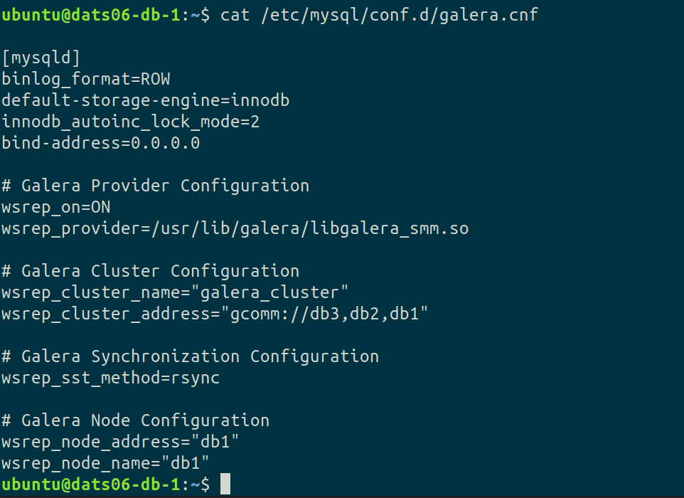
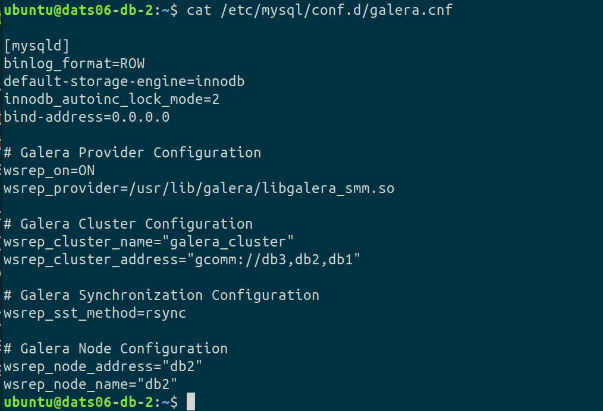
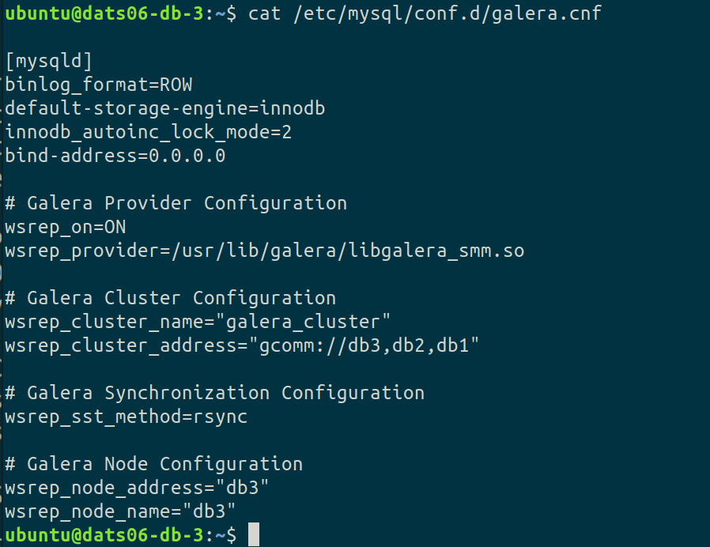
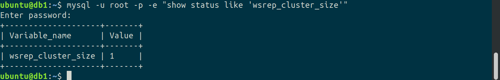
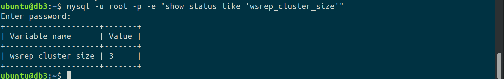
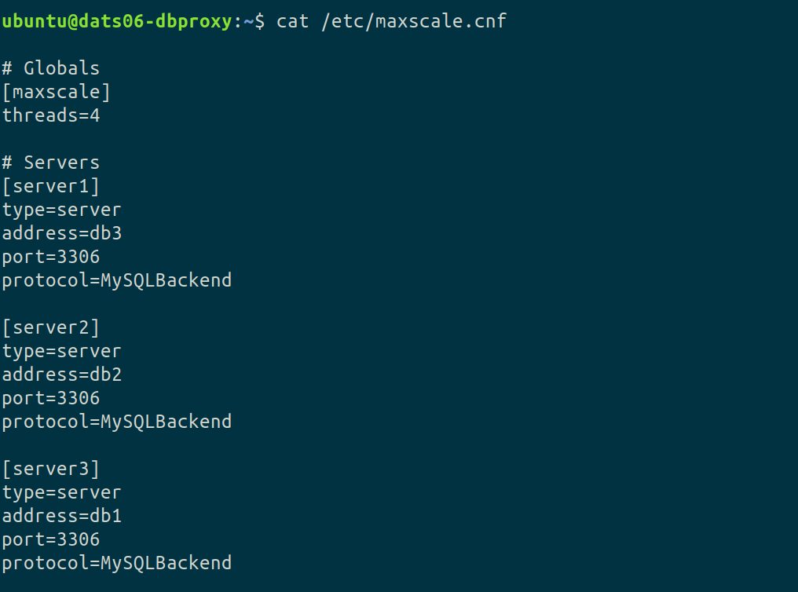
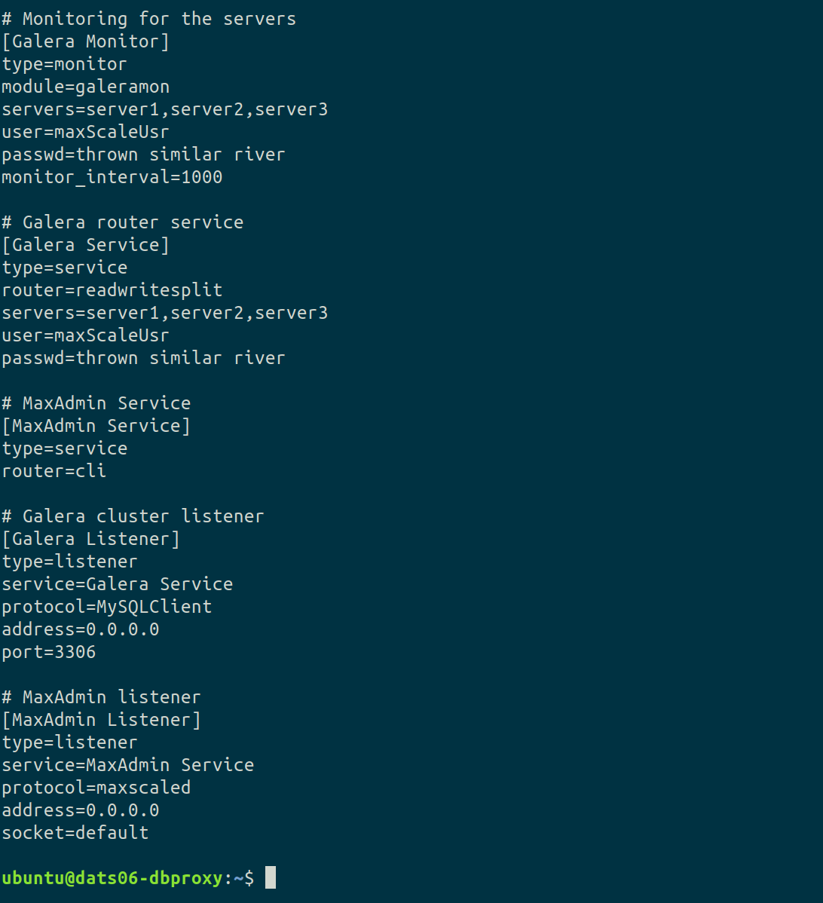
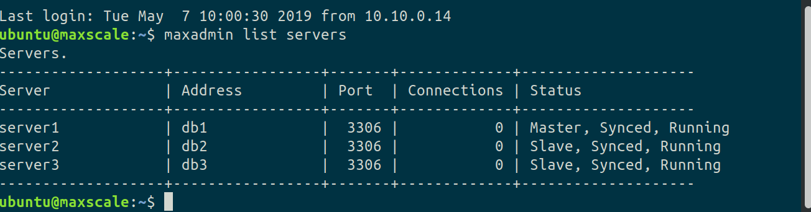
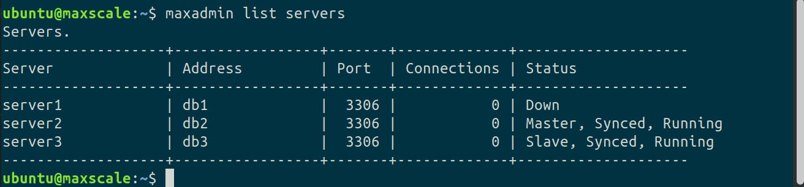

## Oppgave 4 : HA-Database setup.

### On all db servers run the following sequence of commands:

First we add the MariaDB repository key:

```bash
sudo apt-key adv --recv-keys --keyserver hkp://keyserver.ubuntu.com:80 0xF1656F24C74CD1D8
```

Next we add the repository, followed by a update of apt cache:

```bash
sudo add-apt-repository 'deb [arch=amd64,i386,ppc64el] http://ftp.utexas.edu/mariadb/repo/10.1/ubuntu xenial main'
sudo apt-get update -y
```

When the repository is updated we install MariaDB and rsync. This is done using the noninteractive option to avoid being prompted for input during the installation. This will cause mariadb to be setup without a password for the root user. This is beneficial for the rest of the setup process (especially when scripting) but obviously bad from a security standpoint. Therefor it is advised to set a password using the following commands:

```bash
mysql -u root;
UPDATE mysql.user SET password = PASSWORD('new_password') WHERE user = 'root';
```

Note that we are not doing this now, but would otherwise do so. Now, onwards with the installation.

```
sudo DEBIAN_FRONTEND=noninteractive apt-get install mariadb-server rsync -y;
```


### On MariaDB Galeracluster db1 do the following:

Instead of editing the config file found at /etc/mysql/my.cnf , we create a new configuration file. 

```bash
sudo nano /etc/mysql/conf.d/galera.cnf
```

Next we append the following lines to the file:

```bash
[mysqld]
binlog_format=ROW
default-storage-engine=innodb
innodb_autoinc_lock_mode=2
bind-address=0.0.0.0

# Galera Provider Configuration
wsrep_on=ON
wsrep_provider=/usr/lib/galera/libgalera_smm.so

# Galera Cluster Configuration
wsrep_cluster_name="galera_cluster"
wsrep_cluster_address="gcomm://db1,db2,db3"

# Galera Synchronization Configuration
wsrep_sst_method=rsync

# Galera Node Configuration
wsrep_node_address="db1"
wsrep_node_name="db1"
```

### Next we do the same operation on db2 and db3:

In this step we run the exact same command on both servers, the only difference is in the last two lines of the config file:

db2:

````bash
# Galera Node Configuration
wsrep_node_address="db2"
wsrep_node_name="db2"
````

db3:

```bash
# Galera Node Configuration
wsrep_node_address="db3"
wsrep_node_name="db3"
```

Screenshots of the resulting config files on all dbservers. Note that we are not making changes to the my.cnf template file, as this is not a good aproach for production. Instead we are creating new config files at /etc/mysql/conf.d/galera.cnf. 

db1:



db2:



db3:



### Next - starting the Galera cluster:

We run this command on all nodes:

```bash
sudo systemctl stop mysql
```

On the first node (db1), we start the cluster using the following command:

```bash
sudo galera_new_cluster
```

Next we check if the cluster is running using the following command:

```bash
mysql -u root -p -e "show status like 'wsrep_cluster_size'"
```

This produces the following output:



After verifying that the result is as expected, we run the following command on BOTH db2 and db3:

```bash
sudo systemctl start mysql
```

Then we do another check for cluster size, this time we expect size = 3 (this command can be run on any of the db servers):

```bash
mysql -u root -p -e "show status like 'wsrep_cluster_size'"
```

This produces the following output:



As evident by the screenshot, all nodes are part of the cluster. 

Next we create the testdatabase as specified. We are using a script to accomplish this. To avoid unnecessary clutter, this script is not shown here. But it is provided with the other script files if you wish to inspect it. To deploy via the script we run the following command:

```bash
mysql -u root < database-init-script.txt;
```

Then we create a user for web server access and grant the necessary permissions:

```bash
mysql -u root
create user 'dats06'@'%' identified by '$thrown similar river';
grant select on mysql.user to 'dats06'@'%';
grant select on student_grades.* to 'dats06'@'%';
```

Now that the Galera cluster is configured, we move on to setting up MaxScale.

First we set up a user that MaxScale can use to connect to the cluster. We only need to run these commands on db1, as they are replicated to all servers by galera:

```bash
mysql -u root;
```

```mysql
create user 'maxScaleUsr'@'maxscale' identified by 'thrown similar river';
grant select on mysql.user to 'maxScaleUsr'@'maxscale';
grant select on mysql.db to 'maxScaleUsr'@'maxscale';
grant select on mysql.tables_priv to 'maxScaleUsr'@'maxscale';
grant show databases on *.* to 'maxScaleUsr'@'maxscale';
```


### On the MaxScale dbProxy instance, run the following commands:

Install maxscale:

```bash
sudo apt-get -y install maxscale
```

For sanity testing later, we will also install the mariaDB client:

```bash
apt-get -y install mariadb-client
```

Next we need to configure the MaxScale config file located at */etc/maxscale.cnf*.  This is a bare minimum of what we need, but it is sufficient for this application:

````bash
# Globals
[maxscale]
threads=4
 
# Servers
[server1]
type=server
address=db1
port=3306
protocol=MySQLBackend
 
[server2]
type=server
address=db2
port=3306
protocol=MySQLBackend
 
[server3]
type=server
address=db3
port=3306
protocol=MySQLBackend
 
# Monitoring for the servers
[Galera Monitor]
type=monitor
module=galeramon
servers=server1,server2,server3
user=maxScaleUsr
passwd=thrown similar river
monitor_interval=1000
 
# Galera router service
[Galera Service]
type=service
router=readwritesplit
servers=server1,server2,server3
user=maxScaleUsr
passwd=thrown similar river
 
# MaxAdmin Service
[MaxAdmin Service]
type=service
router=cli
 
# Galera cluster listener
[Galera Listener]
type=listener
service=Galera Service
protocol=MySQLClient
# This needs to be here for ipv6 bug in maxscale
address=0.0.0.0
port=3306
 
# MaxAdmin listener
[MaxAdmin Listener]
type=listener
service=MaxAdmin Service
protocol=maxscaled
# This needs to be here for ipv6 bug in maxscale
address=0.0.0.0
socket=default
````

Screenshot of the resulting config file on the maxscale dbproxy server:





To avoid being asked for a password when starting the maxscale service, we need to add the user ubuntu to the maxscale group:

````bash
sudo adduser ubuntu maxscale
````

We start the maxscale service:

```bash
sudo systemctl start maxscale.service
```

Then we confirm everything running as expected:



To check change of  master role, we disable server 1 by running the following command on db1:

```bash
sudo systemctl stop mysql
```

Next we run the following command on dbproxy and observe the result:

```bash
maxadmin list servers
```




