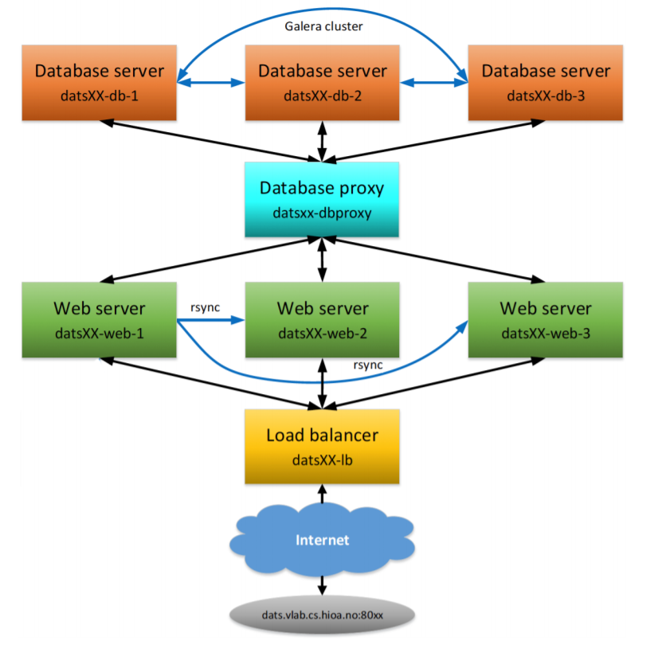

# Portfolio-exam-2-Cloud

**OBS!**
Have to use HioA VPN solution to get access with openstack from outside the school's network:
https://ansatt.oslomet.no/vpn-koble-filserver

*This is the second portfolio exam which must be done and delivered in a group. This contributes 50% for your final grade.* 
In this work, you will setup a cloud-based application architecture using LEMP stack in OpenStack (ALTO). It has a load balancer, three web servers, a database proxy and three database servers as shown in the figure below.

---

The VM created in Lab-C1 (named initially as datsXX-m1 and later changed to datXX-lb) whose IP was provided during the approval of the lab must be used as the load balancer. Reminding again not to terminate this VM! If the VM is somehow terminated, the new IP may not get configured again on time, and you might risk not being unable to complete the assignment on time. Also note that if in case ALTO crashes, all your VMs may disappear (from previous experience). Therefore, it is advised to keep notes of all the required information, steps followed, scripts etc. so that you will be able to redo everything quickly in case such a situation arises.

---

Follow the naming conventions for the virtual machines (VMs) as shown in the figure, whereyour two-digit group number should be used in place of XX. Load balancer should be of **m1.1GB** flavor and all other VMs should be of **m1.512MB4GB** flavor. Use the following OS and software in the setup.
• OS: Ubuntu 16.04
• Web server: Nginx
• Load balancer: HAProxy
• Database server: MariaDB v10.2
• Server-side programming: PHP v7.x
• Database proxy: MariaDB MaxScale 2.2

The whole work is divided into different tasks listed below, which include implementing in ALTO cloud and providing etails as asked in the submitted report. The report should provide properly labelled or captioned diagrams, configuration details and screenshots as asked in these tasks.

1. **VM setup**: This task consists of creating a ssh key (datsXX-key) and a security group (datsXXsecurity), creating VMs with desired flavors, doing minimal required common configurations in VMs such as **naming of hosts**, and setup **locale to Norwegian**. From the security point of view, only the required outside access (such as ssh, web, etc.) to the VMs must be given. This means the required ports only should be opened in the security group. The report should provide the followings:

   - [ ] An architecture diagram of your cloud setup, where all the VMs are labeled with VM names,
     and IPs.
   - [x] Screenshots from ALTO showing created ssh key, security group and security group rules. Label security group rules indicating purpose of the rules.
   - [x] A screenshot of the list of VMs created.
   - [x] A screenshot of the host names defined in /etc/hosts of one of the servers (say, datsXX-lb). Give short hostnames to the servers here, such as lb, web1, web2, web3, db1, db2, db3, and
     maxscale and use names in all the configurations instead of hard coded IPs.
   - [ ] A table listing the VMs with these information: VM name, hostname, IP, flavor, software you
     installed in the VM, and ports used for specific purpose(s).

2. **HAProxy setup**: Setup HAProxy for the load balancer and monitoring. Load balancer should use round robin algorithm with equal weights. HAProxy monitoring page should be configured such that it can be accessed from the url, dats.vlab.cs.hioa.no:80XX/stats. Use your ALTO credentials for the authentication purpose.

   - [x] Provide screenshots of the HAProxy configuration.

   - [x] Provide screenshot of the resulting monitoring web page.

   - [x] Show screenshots of the test results confirming working load balancer by curling a web page testlb.php in a loop from a local computer (e.g., your laptop), which shows alternately changing the web server IP. 

     

3. **Web server setup**: Setup all the web servers using Nginx with the support for dynamic web development with PHP and MariaDB and give a proper ownership and permission to the web root folder for the ‘ubuntu’ user.

   1. [ ] Provide a screenshot of Nginx configuration you updated to enable PHP support in one of
      the web servers (say, datsXX-web-1).

   Setup a simple web deployment mechanism, where datsXX-web-1 is considered as the primary web server and whenever an updated web application is deployed to this server, the application is synchronized (pushed) to the other web servers automatically in every 3 minutes (using rsync and crontab).

   - [ ] Provide a screenshot of the crontab showing the rsync commands used for synchronizing
     the web servers.

     

4. **HA database setup**: Setup a cluster-based high availability database with Galera cluster of three MariaDB database servers (nodes) and a MaxScale database proxy. Create a database named ‘student_grades‘ with two tables as in the lecture slide and add some test data. Create a students-grades.php page that lists the grades of the students on the web, dats.vlab.cs.hioa.no:80XX/students-grades.php. For those who do not know much PHP, the example PHP code given in the lecture slide can be used. This web page should also show the host name or IP of the web server serving the page, at the bottom. Use the **same user name and password as your ALTO** to access the database from the PHP code.

   - [ ] Provide screenshots of the configurations (only for the changes you made) of the 3 database
     servers in the Galera cluster and the MaxScale proxy server.
   - [ ] Provide a screenshot confirming Galera cluster size to 3.
   - [ ] Show the list of servers from the command *maxadmin list servers* in MaxScale
     confirming that the Galera cluster is working as expected.
   - [ ] Also, provide a screenshot of the list of servers showing successful change of master role
     when the current master database is stopped

5. **Automation with scripts**: Automate all the setup tasks above (1 to 4) using bash shell scripts, and name the script files as: vm_setup.sh, lb_setup.sh, web_setup.sh, hadb_setup.sh respectively. Create one more script file, cloud_setup_all.sh which runs all the scripts and do all the tasks automatically by running this script. Only bash, python and OpenStack API commands are allowed in the scripts. All the shell scripts should be fully parameterized to avoid any hard coding of parameter values inside the scripts so that it can be used in any other projects just by modifying the relevant parameters in a parameter file and/or passing command-line parameters, but without modifying the script. Use a single parameter file, datsXX-params.sh to have most of the common
   parameters for all the scripts. Describe each script file briefly in the report about its usage and what it does.

   Script files should be **well documented with appropriate comments.**

6. **Group work details**: Provide following details on your group work.

  - [ ] How you worked as a team [How often did you meet, how tasks were distributed among your group members, whether you managed to make everyone participate and known about all the tasks (not just what s/he did), etc.].
  - [ ] State who did what in terms of concrete tasks and contribution of the individual members in percentage (not for individual tasks, but as a whole project) using the one who contributed the most as a reference (i.e., 100%).
  - [ ] Problems or difficulties faced (if any) regarding working in the group.

7. **Self-evaluation**: Evaluate your own submission by filling up the table below. It has two parts: section-wise expected scores (out of the given full scores in brackets), and comments. Comments should be given point-wise whether you have done what has been asked properly (+), or not done or if any issues/weaknesses (-), and any other comments worth mentioning (*).

### **Hand-in**:

- A PDF report PExam2-Report.pdf.

- SSH private key file (named as datsXX-key.pem) that is used to access VMs. Use **the same key for all the purposes** such as VM access, rsync etc.

- Place all the submission files in a directory structure like:

  PExam2-GroupXX

  - datsXX-key.pem
  - PExam2-Report.pdf
  - scripta

- Compress/zip the project directory into a single file named PExam2-GroupXX.zip (use ZIP compression, not any other such as RAR…), and submit this file in PExam2 (Group) inside **Assignments** in **Canvas**. 
- Important notes:
  - **While evaluating, correctness, completeness, clearness, and preciseness of the answers, and writing and structure of the report in general will be looked into**. Completeness of the report means it should include all the assignment text/questions, diagrams, screenshots, etc. (even if explicitly not asked) such that a reader or an evaluator of the report need not look into the other documents or submitted supporting files for understanding of your answers. Other submitted supporting files and live setups will be used for validation check of the answers.
  - For screenshots of configuration files which are long, you should provide only those parts that are changed or added yourself. Also, avoid redundant screenshots. For example, if it is the same in different servers, give one and say that it is the same in other servers.
  - Everything written in the report should be your own and **any form of copying is not acceptable**.
  - Email submission will not be accepted. Therefore, submit on time to avoid any last-minute technical problem.
  - Avoid multiple submissions. If done so, there is no guarantee that the most recent one will be used for the evaluation.
  - Not following explicitly stated instructions will lead to deduction of points.
  - If in case you couldn't make something working in your implementation, explain what and how you tried to troubleshoot and give a discussion on what do you think could be potential problem(s).
  - Keep only those VMs in ALTO that are required for the tasks (If other VMs are created for some other purpose, delete/terminate them). Presence of any unnecessary VM would be considered as a wrong VM.
  - One should not make any changes in ALTO cloud after your submission. Otherwise, it’s timestamp will be used as your submission date/time and this could lead to deduction of your score (second deadline) or rejection of your submission (after second deadline).
  - There are two deadlines. If the first deadline is missed, 5% of the total score obtained will be deducted. No submission will be accepted after the second deadline.
  - If there is anything not clear or confused or wondering about, do ask the course teacher *ON TIME*
