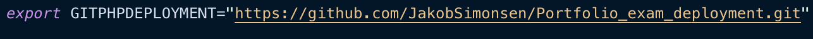

Portfolio-exam-2-Cloud

**OBS!**
Have to use HioA VPN solution to get access with openstack from outside the school's network:
https://ansatt.oslomet.no/vpn-koble-filserver

*This is the second portfolio exam which must be done and delivered in a group. This contributes 50% for your final grade.* 
In this work, you will setup a cloud-based application architecture using LEMP stack in OpenStack (ALTO). It has a load balancer, three web servers, a database proxy and three database servers as shown in the figure below.

------

<span style="color: red">The VM created in Lab-C1 (named initially as datsXX-m1 and later changed to datXX-lb) whose IP was provided during the approval of the lab must be used as the load balancer</span>. Reminding again not to terminate this VM! If the VM is somehow terminated, the new IP may not get configured again on time, and you might risk not being unable to complete the assignment on time. Also note that if in case ALTO crashes, all your VMs may disappear (from previous experience). Therefore, it is advised to <span style="color: red">keep notes of all the required information, steps followed, scripts etc.</span> so that you will be able to redo everything quickly in case such a situation arises.

------

Follow the naming conventions for the virtual machines (VMs) as shown in the figure, whereyour two-digit group number should be used in place of XX. Load balancer should be of **m1.1GB** flavor and all other VMs should be of **m1.512MB4GB** flavor. Use the following OS and software in the setup.
• OS: Ubuntu 16.04
• Web server: Nginx
• Load balancer: HAProxy
• Database server: MariaDB v10.2
• Server-side programming: PHP v7.x
• Database proxy: MariaDB MaxScale 2.2

The whole work is divided into different tasks listed below, which include <span style="color: red">implementing in ALTO cloud</span> and <span style="color: red">providing etails as asked in the submitted report</span>. The report should provide properly labelled or captioned <span style="color: red">diagrams</span>, <span style="color: red">configuration details</span> and <span style="color: red">screenshots</span> as asked in these tasks.

1. **VM setup**: This task consists of creating a ssh key (datsXX-key) and a security group (datsXXsecurity), creating VMs with desired flavors, doing minimal required common configurations in VMs such as **naming of hosts**, and setup **locale to Norwegian**. From the security point of view, only the required outside access (such as ssh, web, etc.) to the VMs must be given. This means the required ports only should be opened in the security group. The report should provide the followings:

- An architecture diagram of your cloud setup, where all the VMs are labeled with VM names,
  and IPs.

  

- Screenshots from ALTO showing created ssh key, security group and security group rules. Label security group rules indicating purpose of the rules.

  Security groups:


Rules of dats06-security:


Keypairs:


A screenshot of the list of VMs created.


- A screenshot of the host names defined in /etc/hosts of one of the servers (say, datsXX-lb). Give short hostnames to the servers here, such as lb, web1, web2, web3, db1, db2, db3, and
  maxscale and use names in all the configurations instead of hard coded IPs.
  
  Load balancer's hosts file:


- A table listing the VMs with these information: VM name, hostname, IP, flavor, software you
  installed in the VM, and ports used for specific purpose(s).

| VMs            | Hostname | IP          | Flavor      | Software                                                     | Ports                      |
| -------------- | -------- | ----------- | ----------- | ------------------------------------------------------------ | -------------------------- |
| dats06-lb      | lb       | 10.10.4.41  | m1.1GB      | HAProxy                                                      | 22, 80                     |
| dats06-web-1   | web1     | 10.10.7.142 | m1.512MB4GB | Nginex<br />MariaDB-client<br />MySQL<br />php<br />Git<br />Cron | 22, 80, 3306               |
| dats06-web-2   | web2     | 10.10.7.143 | m1.512MB4GB | Nginex<br />MariaDB-client<br />MySQL<br />php<br />Git<br />Cron | 22, 80, 3306               |
| dats06-web-3   | web3     | 10.10.7.144 | m1.512MB4GB | Nginex<br />MariaDB-client<br />MySQL<br />php<br />Git<br />Cron | 22, 80, 3306               |
| dats06-db-1    | db1      | 10.10.7.147 | m1.512MB4GB | MariaDB 10.1                                                 | 22, 3306, 4444, 4567, 4568 |
| dats06-db-2    | db2      | 10.10.7.149 | m1.512MB4GB | MariaDB 10.1                                                 | 22, 3306, 4444, 4567, 4568 |
| dats06-db-3    | db3      | 10.10.7.148 | m1.512MB4GB | MariaDB 10.1                                                 | 22, 3306, 4444, 4567, 4568 |
| dats06-dbproxy | dbproxy  | 10.10.7.145 | m1.512MB4GB | MaxScale                                                     | 22, 3306                   |


2. **HAProxy setup**: Setup HAProxy for the load balancer and monitoring. Load balancer should use round robin algorithm with equal weights. HAProxy monitoring page should be configured such that it can be accessed from the url, <span href="dats.vlab.cs.hioa.no:8006/stats" style="color: blue">dats.vlab.cs.hioa.no:80XX/stats</span>. Use your ALTO credentials for the authentication purpose.

- Provide screenshots of the HAProxy configuration.

  HAproxy config:


- Provide screenshot of the resulting monitoring web page.


- Show screenshots of the test results confirming working load balancer by curling a web page <span style="color: blue">testlb.php</span> in a loop from a local computer (e.g., your laptop), which shows alternately changing the web server IP. 


3. **Web server setup**: Setup all the web servers using <span style="color: red">Nginx</span> with the support for dynamic web development with PHP and MariaDB and give a proper ownership and permission to the web root folder for the ‘ubuntu’ user.

- Provide a screenshot of Nginx configuration you updated to enable PHP support in one of
  the web servers (say, datsXX-web-1).

  

Setup a simple <span style="color: red">web deployment</span> mechanism, where datsXX-web-1 is considered as the primary web server and whenever an updated web application is deployed to this server, the application is synchronized (<span style="color: red">pushed</span>) to the other web servers automatically in every <span style="color: red">3 minutes</span> (using rsync and crontab).

- Provide a screenshot of the crontab showing the rsync commands used for synchronizing
  the web servers.

  

  

  

  

4. **HA database setup**: Setup a cluster-based high availability database with <span style="color: red">Galera cluster</span> of three MariaDB database servers (nodes) and a <span style="color: red">MaxScale</span> database proxy. Create a database named ‘<span style="color: blue">student_grades</span>‘ with two tables as in the lecture slide and add some test data. Create a <span style="color: blue">students-grades.php</span> page that lists the grades of the students on the web, <span href="dats.vlab.cs.hioa.no:8006/students-grades.php" style="color: blue">dats.vlab.cs.hioa.no:80XX/students-grades.php</span>. For those who do not know much PHP, the example PHP code given in the lecture slide can be used. This web page should also show the host name or IP of the web server serving the page, at the bottom. Use the **same user name and password as your ALTO** to access the database from the PHP code.

- Provide screenshots of the configurations (only for the changes you made) of the 3 database
  servers in the Galera cluster and the MaxScale proxy server.

  

- Provide a screenshot confirming Galera cluster size to 3.

- Show the list of servers from the command *maxadmin list servers* in MaxScale
  confirming that the Galera cluster is working as expected.

- Also, provide a screenshot of the list of servers showing successful change of master role
  when the current master database is stopped

5. **Automation with scripts**: Automate all the setup tasks above (1 to 4) using bash shell scripts, and name the script files as: <span style="color: blue">vm_setup.sh</span>, <span style="color: blue">lb_setup.sh</span>, <span style="color: blue">web_setup.sh</span>, <span style="color: blue">hadb_setup.sh</span> respectively. Create one more script file, <span style="color: blue">cloud_setup_all.sh</span> which runs all the scripts and do all the tasks automatically by running this script. Only bash, python and OpenStack API commands are allowed in the scripts. All the shell scripts should be fully parameterized to avoid any hard coding of parameter values inside the scripts so that it can be used in any other projects just by modifying the relevant parameters in a parameter file and/or passing command-line parameters, but without modifying the script. Use a single parameter file, <span style="color: blue">datsXX-params.sh</span> to have most of the common
   parameters for all the scripts. Describe each script file briefly in the report about its usage and what it does.

   Script files should be **well documented with appropriate comments.**

   **Decisions:** Explanation for the various decisions we have made throughout the project

- When making these scripts we assumed that the load balancer VM is already present and at a base ubuntu 16.04 setup with no added software. When the load balancer is revert to base Ubuntu the hostname is reset to dats06 and we then change it to lb.

- Keygen: We have decided to not create a new key since our load balancer, because it is never deleted, will have the dats06-key.pem key that existed before we ran the script. Therefore we continue using this key for any subsequent virtual machines we create in the scripts. If we were to make a key we would do it like this:

  ```bash
  # Creates keypair and puts it in the .ssh folder and gives it permission 400 so that no one except the owner can read it
  openstack keypair create $KEYPAIRNAME > $KEYLOCATION
  chmod 400 $KEYLOCATION
  ```

  This creates the key on the ALTO cloud and redirects it into a file on your computer and gives it proper permissions

- Security group: We, for this assignment, have only made a single security group, however we see that there is a possibility to have a second security group since the load balancer, for example, does not need any access to MySQL or the galera cluster. We think this will 

6. **Group work details**: Provide following details on your group work.

How you worked as a team [How often did you meet, how tasks were distributed among your group members, whether you managed to make everyone participate and known about all the tasks (not just what s/he did), etc.].

- We have been working very well as a team, we have met almost every day the last 2 weeks of the assignment to work on it. In the beginning we assigned tasks to each member, on "part" to each one: Michael(VM-setup) Ole-Martin(LB-setup), Jakob(Web-setup) and Fredrik(Database-setup). We all know what everyone is doing because we help each other. The group has worked together in a good way which has contributed to

State who did what in terms of concrete tasks and contribution of the individual members in percentage (not for individual tasks, but as a whole project) using the one who contributed the most as a reference (i.e., 100%).

|                    | Ole-Martin (s325905) | Michael (s325903) | Jakob(s325908) | Fredrik(s325853) |
| ------------------ | -------------------- | ----------------- | -------------- | ---------------- |
| Task 1             | x                    | x                 |                |                  |
| Task 2             | x                    |                   |                |                  |
| Task 3             | x                    |                   | x              |                  |
| Task 4             |                      |                   |                | x                |
| vm_setup.sh        | x                    | x                 |                |                  |
| lb_setup.sh        | x                    |                   |                |                  |
| web_setup.sh       | x                    |                   | x              |                  |
| hadb_setup.sh      | x                    |                   |                | x                |
| cloud_setup_all.sh | x                    | x                 | x              | x                |
| Task 6.            |                      | x                 |                |                  |
| Task 7.            |                      | x                 |                |                  |

​	Due to the lb_setup.sh script being very small and easy to setup, Ole-Martin helped out the other scripts in addition to doing it.

​	Due to the interconnectivity of the tasks, everyone has contributed to some degree to every task. The ones marked are the main contributers to each task.

​	Work percentage:

​	Ole-Martin: 100%

​	Michael: 100%

​	Jakob: 100%

​	Fredrik: 100%

​	Problems or difficulties faced (if any) regarding working in the group.

- We have had prior experience working as a group, so the first thing we did when we started working on the assignment was to distribute the tasks among us and create a git repo. Due to all of this we have had very few issues working together as a group

7. **Self-evaluation**: Evaluate your own submission by filling up the table below. It has two parts: section-wise expected scores (out of the given full scores in brackets), and comments. Comments should be given point-wise whether you have done what has been asked properly (+), or not done or if any issues/weaknesses (-), and any other comments worth mentioning (*).

   | Tasks (points possible)     | Expected points | Comments                                                     |
   | --------------------------- | --------------- | ------------------------------------------------------------ |
   | VM-setup (25)               | 25              | (+) All VMs setup correctly with proper hosts files          |
   | HAProxy setup (10)          | 10              | (+) HAProxy setup to roundrobin traffic between web servers  |
   | Web server setup (15)       | 15              | (+) DevOps: Automatic web deployment using Git<br />(+) Web servers working correctly<br />(+) Web servers displaying grades using PHP |
   | HA DB setup (17)            | 17              | (+) Galera setup properly<br />(+) MaxScale setup properly<br /> |
   | Automation with scripts(25) | 25              | (+) params script with all parameters needed<br />(+) All scripts setup and working properly |
   | Group work details (3)      | 3               | (+) Teamwork has been working well                           |
   | Self-Evaluation (2)         | 2               | (+) Honest self-evaluation                                   |
   | Report quality(3)           | 3               | (+) Clean and readable report<br />(+) All screenshots provided<br />(+) All questions provided |
   | Total score(100)            |                 |                                                              |

   